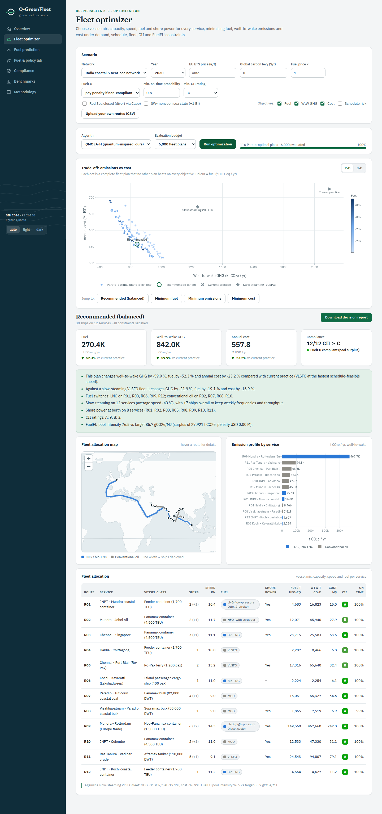

<h1>
  <picture>
    <source media="(prefers-color-scheme: dark)" srcset="docs/brand/q-greenfleet-logo-white.svg">
    
  </picture>
</h1>

**Quantum-inspired fuel consumption prediction and green fleet optimization.**
Built for Smart India Hackathon 2026, problem statement **26138** (Egreen Quanta · Clean & Green Technology).

Q-GreenFleet predicts ship fuel consumption with a quantum-inspired hybrid model, then optimizes a whole fleet's
deployment for every service:
- vessel type and capacity, fleet size and cruising speed;
- fuel pathway: HFO, VLSFO, MGO, LNG, bio-LNG, grey/bio/e-methanol, grey/blue/e-ammonia, grey/e-hydrogen;
- shore power at berth.

It minimises **fuel, well-to-wake greenhouse-gas emissions and cost** while meeting cargo demand, schedule
reliability, fleet availability, IMO CII and FuelEU Maritime. Every result is benchmarked against conventional methods
and against an exact MILP optimum.



## What is inside

| PS deliverable | What we built |
|---|---|
| **1. Fuel consumption prediction model** | **Q-PHYS**: physics prior (IMO Fourth GHG Study power model + Kwon weather + SFOC curve) + **Matrix-Product-State tensor network** (spin-coherent qudit feature encoding, DMRG-style training) + QPSO-tuned *certified-monotone* booster + QIEA feature selection + split-conformal intervals. Inputs are exactly the PS's: **speed, load, weather, vessel type**. |
| **2. Mathematical optimization formulation** | Multi-objective MINLP: per-route vessel class (type & capacity), fleet size, speed, fuel pathway, shore power. Objectives min fuel / min WtW emissions / min cost (+ optional schedule risk). Constraints: demand, weekly frequency, on-time probability, fleet availability, CII ≥ C, FuelEU pooling, emission cap. See [docs/math_model.md](docs/math_model.md). |
| **3. Quantum-inspired optimization algorithm** | **QMOEA-H**: qudit registers per route, superposition crossover, quantum memory register, δ-potential-well (QPSO) speed moves, Hadamard reset, elitist Pareto survival. Plus a **QUBO** formulation solved by a from-scratch **path-integral simulated quantum annealer** and exported unchanged for D-Wave. See [docs/algorithms.md](docs/algorithms.md). |
| **4. Software platform / DSS** | FastAPI + React dashboard: live Pareto front streamed over SSE, fleet-allocation maps, emission profiles, scenario lab (2025–2050, fuel and carbon prices, Red Sea closure, monsoon, CSV upload), compliance views, downloadable decision report. |
| **5. Demonstration** | India coastal & near-sea network (12 services, Sagarmala / Harit Sagar / green-hydrogen ports), EU FuelEU/ETS network, and **MILP-certified synthetic networks of up to 100 routes / 1,250 ships**. Benchmarks in [reports/](reports/). Implementation guide in [docs/implementation_guide.md](docs/implementation_guide.md). |

Deliverable-by-deliverable tracking: [docs/deliverables.md](docs/deliverables.md).

**Logo.** The mark is a ship's load-line disc (the Plimsoll mark painted on every hull) with a waterline through it:
staying within limits, which is what the optimizer does with emissions. SVG and PNG files, for light and dark
backgrounds, are in [docs/brand/](docs/brand/).

## Results at a glance

**Prediction** (held-out test data; physics-informed synthetic fleet, 20 ships, 10 vessel classes):

| Scenario | Q-PHYS (ours) | Best conventional baseline | Notes |
|---|---|---|---|
| Known ships, future period | **3.29 % MAPE** | grey-box physics 3.41 %, LightGBM 5.28 % | Wilcoxon p ≤ 0.001 vs every baseline (better on 17–20 of 20 ships) |
| Unseen ships of known classes | **5.64 %** | LightGBM 5.98 % | lead over LightGBM not significant (p = 0.35) |
| Unseen vessel classes | **6.01 %** | physics 7.85 %; LightGBM 34.8 % | physics prior lets the hybrid extrapolate where pure ML fails |

- **Uncertainty**: 90 % conformal intervals cover 0.89 of known-ship data; for brand-new ships they are conservative (0.98–0.998).
- **Tuning**: at an equal budget, QPSO found the best hyperparameters (validation MAE 1.207, vs PSO 1.211, TPE 1.230, random 1.246). This is a single seed.

**Fleet optimization** (8,000 plan evaluations per run, 3 seeds; hypervolume, higher is better):

| Instance | QMOEA-H (ours) | MOPSO | NSGA-III | NSGA-II | Lowest-GHG plan found (ours vs best other) |
|---|---|---|---|---|---|
| India 2030 (12 services, tuning instance) | **0.797** | 0.692 | 0.542 | 0.091 | **670 kt** vs 740 kt |
| EU 2030 (6 services, *not* used for tuning) | **0.866** | 0.823 | 0.789 | 0.754 | **202 kt** vs 223 kt |
| Tight 100-route network (1,251 ships, MILP-certified feasible) | **feasible 2/2, HV 0.33** | feasible 1/2 | never feasible | never feasible | |

Friedman tests: p = 0.004 (India) and p = 0.016 (EU), with QMOEA-H ranked first on both.

**Against the exact optimum** (India 2030, speeds discretised, MILP solved in 1.4 s):

| Algorithm | Fuel gap | GHG gap | Cost gap |
|---|---|---|---|
| **QMOEA-H** | **1.1 %** | **3.1 %** | **3.2 %** |
| MOPSO | 1.0 % | 14.6 % | 4.8 % |
| NSGA-III | 4.8 % | 13.0 % | 8.4 % |

**QUBO + simulated quantum annealing**: every annealed plan is feasible and lands 1.6–7.5 % from the exact optimum.
Our from-scratch path-integral SQA has the best median gap in 4 of 6 cases; OpenJij SQA edges it on India min-cost
(effectively a tie) and on EU balanced.

**Where QMOEA-H loses**: in the scalability sweep (loosely constrained synthetic networks, one run per size), classical
MOPSO reaches a higher hypervolume at 12, 50 and 100 routes (0.71 vs 0.15 at 50 routes) and a smaller cost gap to the MILP
at 50 and 100 routes. QMOEA-H leads only at 25 routes, and its wall time per evaluation is 2–4× that of MOPSO. This is listed as
future work in [docs/algorithms.md](docs/algorithms.md).

**Impact (India 2030 recommended plan)**: about −60 % WtW GHG, −50 % fuel and −20 % cost vs current practice, with all
CII, FuelEU and schedule constraints met. Against an already slow-steaming VLSFO fleet: about −34 % GHG and −15 % cost.

Full tables, statistical tests and figures: [reports/prediction_benchmark.md](reports/prediction_benchmark.md) and
[reports/optimization_benchmark.md](reports/optimization_benchmark.md).

## Quick start

```bash
make install && make install-web   # Python 3.11 venv + Node deps
make api                           # http://localhost:8000  (API docs at /docs)
make web                           # http://localhost:5173  (dashboard)
```

Or run everything in one container: `docker compose up --build`, then open http://localhost:8000.

**Free live deployment (Render).** [](https://render.com/deploy?repo=https://github.com/DeepakSinghhh/PS-138)
`render.yaml` deploys the Docker image on Render's free plan (no card; about 270 MB of the 512 MB limit is used) and
redeploys on every push. `.github/workflows/keep-alive.yml` pings it every 10 minutes so it does not sleep.

A narrated walkthrough of the prototype is in [docs/demo/](docs/demo/) (`Q-GreenFleet_walkthrough.mp4`, 4½ min, with subtitles and a narration script).

A trained model ships in `backend/artifacts/`. Retrain with `make data && make train`. Run `make test` for the test
suite, and `make bench-quick` to regenerate the benchmarks.

## Architecture

```
 data/raw (FuelCast · EU MRV · Kaggle · your logs)  ──►  canonical schema (speed, load, weather, vessel type)
            │  (physics-informed synthetic fleet when real data is absent)
            ▼
 Physics & emissions engine ── IMO GHG4 power · Kwon weather · SFOC · FuelEU WtW factors · CII · FuelEU · EU ETS
            │
            ▼
 Q-PHYS prediction ── calibrated physics prior ▸ QIEA feature selection ▸ QPSO-tuned monotone booster
            │          ▸ MPS tensor network ▸ conformal intervals ▸ ship head / fleet head
            ▼ (certified-monotone fuel surrogate)
 Fleet optimization ── vectorised fleet model (~55k plans/s) ▸ QMOEA-H │ MOQPSO │ NSGA-II/III │ SPEA2 │ MOEA/D │ MOPSO
            │           ▸ exact MILP (optimality gaps) ▸ QUBO + simulated quantum annealing (D-Wave-ready)
            ▼
 Decision analytics ── knee point · plain-language explanation · Monte Carlo robustness · MACC · 2025–2050 pathway
            ▼
 FastAPI (jobs + SSE) ──► React dashboard ──► printable decision report
```

## Three-minute demo script

1. **Overview**: the India network on the map. Current practice emits about 2.1 Mt CO₂e a year, fails CII on 11 of 12 services in 2030 and owes about $22 M a year in FuelEU penalties.
2. **Fleet optimizer**: press *Run optimization*. The Pareto front streams in live, far from the grey reference plans. Click
   *Recommended*: roughly −60 % GHG, −50 % fuel and −20 % cost, all constraints satisfied. Read the explanation, hover the map,
   then click *Minimum emissions* to show the ammonia/methanol extreme. Download the decision report.
3. **Scenario levers**: tick *Red Sea closed*. The Europe service reroutes via the Cape (6,348 → 11,027 nm); re-run and compare.
4. **Fuel prediction**: move the speed and wave sliders. The conformal band tracks the prediction, which sits next to the
   physics-only curve. Switch the fuel system to e-ammonia. Show the tensor-network entanglement chart.
5. **Fuel & policy lab**: run the 2025→2050 pathway (conventional → LNG → e-ammonia), then the MACC. Anneal the QUBO and
   compare the gap to the exact MILP.
6. **Benchmarks**: QMOEA-H vs NSGA-II/III, MOPSO and others (hypervolume, convergence, MILP gaps, scalability to 100 routes), including where it loses.

## Honest notes
- Everything runs on classical hardware. "Quantum-inspired" names the algorithms' mechanics: tensor networks,
  superposition/measurement, tunnelling, annealing. It is not a speed-up claim.
- The build environment could not reach Hugging Face, Kaggle or EMSA, so prediction results use **physics-informed synthetic
  telemetry**. Loaders for FuelCast, EU MRV and the Kaggle set pick up real files from `data/raw/` automatically. See
  [docs/data_card.md](docs/data_card.md).
- Alternative-fuel prices, bunkering-availability years and e-fuel well-to-tank factors are scenario assumptions (cited
  and editable in `backend/config/`).
- QMOEA-H was tuned on the India instance. The EU and synthetic networks test generalisation, and the benchmark reports
  where classical methods do better.

## Documentation
[Problem statement](docs/problem_statement.md) · [Deliverables](docs/deliverables.md) · [Mathematical model](docs/math_model.md) ·
[Algorithms](docs/algorithms.md) · [Implementation guide](docs/implementation_guide.md) · [Data card](docs/data_card.md) ·
[Model card](docs/model_card.md)
