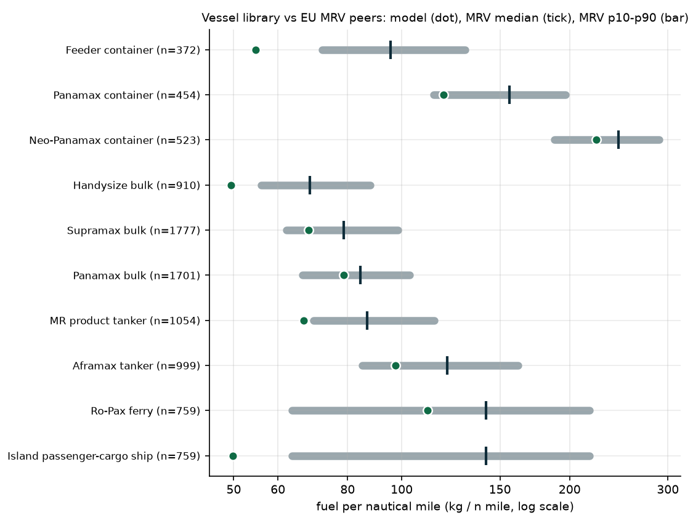

# Vessel library vs EU MRV

Real annual reports from EU MRV (THETIS-MRV, reporting years 2023, 2024): 26,999 ship-years, 23,009 with more than 500 h at sea and plausible speed and fuel per mile. Generated by `python -m greenfleet.benchmark.mrv_validation`.

For each class, the peers are MRV ships of the same type whose average cargo carried over laden and ballast legs (fuel per n mile / fuel per tonne-n mile of transport work) is 30%–80% of the class's deadweight. Passenger ships report transport work per passenger, so the Ro-Pax classes are compared with all Ro-pax ships. The model value is the nominal physics model's fuel per n mile at the peers' median speed, average draft (0.85 × design) and Beaufort 4: a sea passage only. MRV totals include fuel burnt in port and at anchor; the CO₂ share emitted at berth in EU ports (reported separately) is removed, giving the sea-passage figures below. Fuel at anchor and in non-EU ports cannot be separated, so the model should still sit somewhat below the MRV median.

**Result: the model lies inside the MRV p10–p90 band for 6 of 10 classes (5 of 8 size-matched cargo classes). For cargo classes it gives 0.57–0.93 × the MRV median: close for the larger classes, and clearly low for the smallest ones (feeder container, Handysize, MR tanker), whose library parameters under-predict real fuel use and are the first candidates for recalibration.** The island passenger-cargo class has no size-matched peers (type-level comparison only).

Fuel per n mile in kg; MRV p10/p50/p90 are sea-passage figures (EU at-berth share removed).

| class | MRV type | size-matched | peers | median speed kn | at-berth CO₂ share | MRV total p50 | MRV p10 | MRV p50 | MRV p90 | model | model / MRV p50 | model percentile |
|---|---|---|---|---|---|---|---|---|---|---|---|---|
| Feeder container (1,700 TEU) | Container ship | yes | 372 | 11.707 | 5 % | 101.1 | 71.979 | 95.585 | 129.9 | 54.728 | 0.573 | 1 |
| Panamax container (4,500 TEU) | Container ship | yes | 454 | 13.436 | 3 % | 161.9 | 114.2 | 156.0 | 196.6 | 118.7 | 0.761 | 13 |
| Neo-Panamax container (13,000 TEU) | Container ship | yes | 523 | 14.722 | 3 % | 253.0 | 187.8 | 244.8 | 289.3 | 223.5 | 0.913 | 32 |
| Handysize bulk (35,000 DWT) | Bulk carrier | yes | 910 | 10.475 | 4 % | 72.315 | 55.996 | 68.469 | 87.786 | 49.436 | 0.722 | 3 |
| Supramax bulk (58,000 DWT) | Bulk carrier | yes | 1777 | 10.738 | 4 % | 82.280 | 62.097 | 78.752 | 98.457 | 68.066 | 0.864 | 24 |
| Panamax bulk (82,000 DWT) | Bulk carrier | yes | 1701 | 10.778 | 3 % | 87.220 | 66.342 | 84.362 | 103.3 | 78.629 | 0.932 | 36 |
| MR product tanker (50,000 DWT) | Oil tanker, Chemical tanker | yes | 1054 | 11.402 | 7 % | 92.980 | 69.518 | 86.703 | 114.3 | 66.769 | 0.770 | 7 |
| Aframax tanker (110,000 DWT) | Oil tanker, Chemical tanker | yes | 999 | 11.034 | 7 % | 131.3 | 85.030 | 120.7 | 161.7 | 97.383 | 0.807 | 18 |
| Ro-Pax ferry (1,200 pax) | Ro-pax ship | type only | 759 | 15.623 | 7 % | 150.9 | 63.619 | 141.5 | 217.1 | 111.2 | 0.786 | 31 |
| Island passenger-cargo ship (400 pax) | Ro-pax ship | type only | 759 | 15.623 | 7 % | 150.9 | 63.619 | 141.5 | 217.1 | 49.781 | 0.352 | 6 |

**Robustness.** Model ÷ MRV median when peers are matched more tightly on cargo size:

| class | band 0.30-0.80 × DWT | band 0.40-0.70 × DWT | band 0.45-0.60 × DWT |
|---|---|---|---|
| Feeder container (1,700 TEU) | 0.573 | 0.565 | 0.552 |
| Panamax container (4,500 TEU) | 0.761 | 0.750 | 0.725 |
| Neo-Panamax container (13,000 TEU) | 0.913 | 0.897 | 0.908 |
| Handysize bulk (35,000 DWT) | 0.722 | 0.730 | 0.733 |
| Supramax bulk (58,000 DWT) | 0.864 | 0.858 | 0.873 |
| Panamax bulk (82,000 DWT) | 0.932 | 0.910 | 0.910 |
| MR product tanker (50,000 DWT) | 0.770 | 0.781 | 0.786 |
| Aframax tanker (110,000 DWT) | 0.807 | 0.748 | 0.754 |

The gap barely moves with the band, so it is not an artefact of peer selection. The large classes sit near 0.9 (the remaining ~10 % is fuel at anchor and in non-EU ports, which MRV does not separate). Bringing a class to that level would need about 0.9 ÷ (its ratio) more fuel: roughly ×1.6 for the feeder, ×1.25 for Handysize, ×1.2 for the MR tanker and Panamax container, ×1.1 for the Aframax. A single factor on propulsion power is not physically consistent (the feeder would no longer reach its design speed within its engine power), and a different speed-power exponent cannot explain it either (the feeder and the Neo-Panamax run at similar fractions of design speed but differ by 1.6×). The library is therefore left as it is and the gap is reported here. Plausible causes for small ships, such as reefer and hotel loads and older or fouled hulls, need ship-level data to separate.

