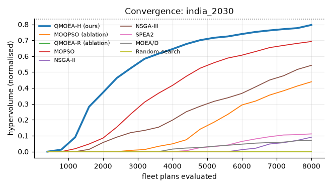
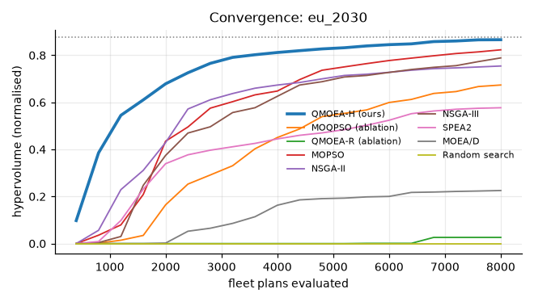
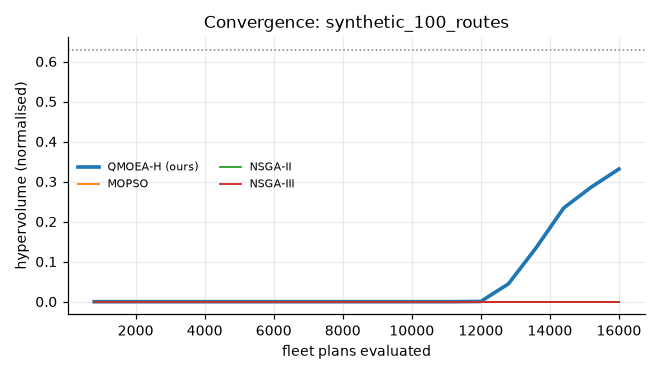
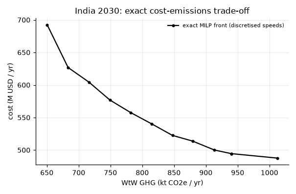
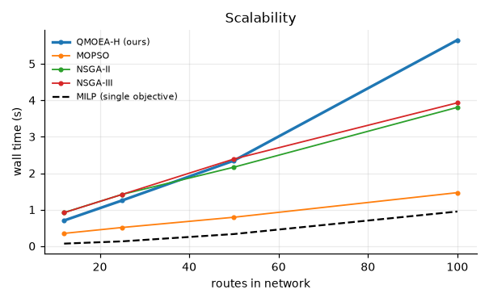

# Optimization benchmark

Generated by `make bench-quick` / `make bench-full`. Every algorithm evaluates fleet plans through the same tracker (identical budgets, identical feasibility rules), and front quality is measured on normalised objectives (fuel, WtW emissions, cost) with a common reference front.

Budget: 8,000 plan evaluations per run, 3 seeds (large-scale: 16,000).
QMOEA-H hyperparameters were set on the India instance; the EU and synthetic instances were not used for tuning.

## india_2030

Current-practice reference plan (VLSFO, fastest schedule-feasible speed, no shore power): fuel = 566,576.8, emissions = 2,097,123.8, cost = 725.9

| Algorithm | HV | sd | IGD+ | evals to 95 % ref HV | feasible | best fuel t | best GHG t | best cost M$ | s |
|---|---|---|---|---|---|---|---|---|---|
| QMOEA-H (ours) | 0.797 | 0.041 | 0.038 | 6,400 | 3/3 | 262,972 | 669,662 | 500.3 | 0.996 |
| MOPSO | 0.692 | 0.062 | 0.064 | - | 3/3 | 263,265 | 740,895 | 513.7 | 0.467 |
| NSGA-III | 0.542 | 0.116 | 0.145 | - | 3/3 | 267,757 | 740,905 | 533.1 | 1.008 |
| MOQPSO (ablation) | 0.439 | 0.062 | 0.223 | - | 3/3 | 270,765 | 740,316 | 520.6 | 0.380 |
| SPEA2 | 0.112 | 0.158 | 4.058 | - | 3/3 | 368,564 | 1,029,497 | 637.8 | 1.313 |
| NSGA-II | 0.091 | 0.128 | 4.152 | - | 3/3 | 371,778 | 1,022,698 | 653.0 | 1.074 |
| MOEA/D | 0.071 | 0.091 | 1.138 | - | 3/3 | 297,135 | 822,660 | 586.5 | 10.321 |
| QMOEA-R (ablation) | 0.000 | 0.000 | - | - | 0/3 | - | - | - | 0.693 |
| Random search | 0.000 | 0.000 | - | - | 0/3 | - | - | - | 0.142 |

Mann-Whitney U on hypervolume (H1: QMOEA-H higher):

| vs | p-value | QMOEA-H mean higher |
|---|---|---|
| MOQPSO (ablation) | 0.050 | yes |
| QMOEA-R (ablation) | 0.032 | yes |
| MOPSO | 0.100 | yes |
| NSGA-II | 0.038 | yes |
| NSGA-III | 0.050 | yes |
| SPEA2 | 0.038 | yes |
| MOEA/D | 0.050 | yes |
| Random search | 0.032 | yes |

Friedman test p = 0.00393; mean ranks: QMOEA-H (ours) 1.00, MOPSO 2.00, NSGA-III 3.00, MOQPSO (ablation) 4.00, MOEA/D 6.33, SPEA2 6.50, NSGA-II 6.83, QMOEA-R (ablation) 7.67, Random search 7.67

## eu_2030

Current-practice reference plan (VLSFO, fastest schedule-feasible speed, no shore power): fuel = 607,496.5, emissions = 2,248,583.8, cost = 837.1

| Algorithm | HV | sd | IGD+ | evals to 95 % ref HV | feasible | best fuel t | best GHG t | best cost M$ | s |
|---|---|---|---|---|---|---|---|---|---|
| QMOEA-H (ours) | 0.866 | 0.005 | 0.025 | - | 3/3 | 298,433 | 202,438 | 535.1 | 1.171 |
| MOPSO | 0.823 | 0.021 | 0.029 | - | 3/3 | 299,228 | 256,965 | 551.7 | 0.703 |
| NSGA-III | 0.789 | 0.074 | 0.044 | - | 3/3 | 302,285 | 249,055 | 565.3 | 1.311 |
| NSGA-II | 0.754 | 0.059 | 0.055 | - | 3/3 | 302,387 | 253,461 | 547.4 | 1.378 |
| MOQPSO (ablation) | 0.674 | 0.020 | 0.106 | - | 3/3 | 303,062 | 224,311 | 551.8 | 0.652 |
| SPEA2 | 0.577 | 0.374 | 0.247 | - | 3/3 | 308,488 | 222,995 | 567.9 | 1.794 |
| MOEA/D | 0.226 | 0.160 | 0.980 | - | 3/3 | 333,621 | 368,985 | 608.4 | 12.743 |
| QMOEA-R (ablation) | 0.026 | 0.035 | 0.819 | - | 3/3 | 325,627 | 355,384 | 609.6 | 0.517 |
| Random search | 0.000 | 0.000 | 2.353 | - | 3/3 | 370,345 | 566,825 | 755.7 | 0.138 |

Mann-Whitney U on hypervolume (H1: QMOEA-H higher):

| vs | p-value | QMOEA-H mean higher |
|---|---|---|
| MOQPSO (ablation) | 0.050 | yes |
| QMOEA-R (ablation) | 0.050 | yes |
| MOPSO | 0.050 | yes |
| NSGA-II | 0.050 | yes |
| NSGA-III | 0.050 | yes |
| SPEA2 | 0.200 | yes |
| MOEA/D | 0.050 | yes |
| Random search | 0.032 | yes |

Friedman test p = 0.0155; mean ranks: QMOEA-H (ours) 1.33, NSGA-III 3.00, MOPSO 3.33, SPEA2 4.00, NSGA-II 4.33, MOQPSO (ablation) 5.67, MOEA/D 7.00, QMOEA-R (ablation) 7.67, Random search 8.67

## synthetic_100_routes

| Algorithm | HV | sd | IGD+ | evals to 95 % ref HV | feasible | best fuel t | best GHG t | best cost M$ | s |
|---|---|---|---|---|---|---|---|---|---|
| QMOEA-H (ours) | 0.331 | 0.331 | 0.668 | 16,000 | 2/2 | 6,114,924 | 18,530,265 | 11,206 | 3.807 |
| MOPSO | 0.000 | 0.000 | 7.867 | - | 1/2 | 6,761,028 | 21,564,260 | 11,883 | 0.821 |
| NSGA-II | 0.000 | 0.000 | - | - | 0/2 | - | - | - | 2.698 |
| NSGA-III | 0.000 | 0.000 | - | - | 0/2 | - | - | - | 2.856 |

## Exact reference (MILP) and optimality gaps

With speeds discretised to 5 levels the multiple-choice MILP is exact. Options per route after dominance pruning: [37, 102, 133, 8, 56, 48, 194, 53, 14, 105, 108, 77]. MILP time for all extremes and a 12-point ε-front: 1.4 s.

Exact optima: fuel = 259,884.7, emissions = 650,549.2, cost = 487.7

| Algorithm | fuel gap % | GHG gap % | cost gap % | IGD+ vs exact front | feasible runs |
|---|---|---|---|---|---|
| QMOEA-H (ours) | 1.113 | 3.089 | 3.211 | 0.050 | 3 |
| MOPSO | 1.043 | 14.619 | 4.794 | 0.107 | 3 |
| NSGA-II | 7.634 | 17.764 | 13.050 | 0.292 | 2 |
| NSGA-III | 4.755 | 12.970 | 8.396 | 0.178 | 3 |

## QUBO + (simulated) quantum annealing

Fleet QUBO with one-hot route variables, lazily added availability penalties and a Lagrangian FuelEU price. Gap = weighted objective of the annealed plan vs the exact MILP optimum of the same weighted objective (evaluated with the exact fleet model).

| network | weights | solver | median gap % | mean gap % | feasible | s |
|---|---|---|---|---|---|---|
| india | fuel 0.33/emis 0.33/cost 0.33 | pi_sqa | 2.028 | 2.000 | 1.000 | 9.334 |
| india | fuel 0.33/emis 0.33/cost 0.33 | openjij_sqa | 8.395 | 8.365 | 1.000 | 9.617 |
| india | fuel 0.33/emis 0.33/cost 0.33 | openjij_sa | 4.895 | 4.330 | 1.000 | 0.972 |
| india | cost 1.00 | pi_sqa | 2.412 | 3.456 | 1.000 | 15.512 |
| india | cost 1.00 | openjij_sqa | 2.374 | 3.018 | 1.000 | 12.990 |
| india | cost 1.00 | openjij_sa | 4.103 | 4.068 | 1.000 | 1.057 |
| india | emis 0.70/cost 0.30 | pi_sqa | 4.204 | 6.147 | 1.000 | 12.070 |
| india | emis 0.70/cost 0.30 | openjij_sqa | 4.937 | 6.991 | 1.000 | 9.501 |
| india | emis 0.70/cost 0.30 | openjij_sa | 4.953 | 4.881 | 1.000 | 1.163 |
| eu | fuel 0.33/emis 0.33/cost 0.33 | pi_sqa | 7.477 | 5.910 | 1.000 | 12.361 |
| eu | fuel 0.33/emis 0.33/cost 0.33 | openjij_sqa | 6.934 | 6.616 | 1.000 | 6.291 |
| eu | fuel 0.33/emis 0.33/cost 0.33 | openjij_sa | 8.894 | 8.044 | 1.000 | 0.532 |
| eu | cost 1.00 | pi_sqa | 2.609 | 2.365 | 1.000 | 4.405 |
| eu | cost 1.00 | openjij_sqa | 4.641 | 4.596 | 1.000 | 2.844 |
| eu | cost 1.00 | openjij_sa | 4.872 | 6.083 | 1.000 | 0.406 |
| eu | emis 0.70/cost 0.30 | pi_sqa | 1.631 | 1.906 | 1.000 | 9.611 |
| eu | emis 0.70/cost 0.30 | openjij_sqa | 4.032 | 5.590 | 1.000 | 3.469 |
| eu | emis 0.70/cost 0.30 | openjij_sa | 6.577 | 6.022 | 1.000 | 0.606 |

## Scalability

| routes | ships available | method | HV | cost gap % vs MILP | s | ms / 1000 evals |
|---|---|---|---|---|---|---|
| 12 | 104 | QMOEA-H (ours) | 0.654 | 4.667 | 0.703 | 0.088 |
| 12 | 104 | MOPSO | 0.741 | 5.309 | 0.350 | 0.044 |
| 12 | 104 | NSGA-II | 0.000 | 29.959 | 0.920 | 0.115 |
| 12 | 104 | NSGA-III | 0.000 | 22.341 | 0.917 | 0.115 |
| 12 | 104 | MILP min-cost | - | 0.000 | 0.069 | - |
| 25 | 196 | QMOEA-H (ours) | 0.868 | 13.150 | 1.254 | 0.109 |
| 25 | 196 | MOPSO | 0.590 | 14.039 | 0.511 | 0.044 |
| 25 | 196 | NSGA-II | 0.000 | 45.901 | 1.419 | 0.123 |
| 25 | 196 | NSGA-III | 0.000 | 34.436 | 1.418 | 0.123 |
| 25 | 196 | MILP min-cost | - | 0.000 | 0.131 | - |
| 50 | 387 | QMOEA-H (ours) | 0.147 | 21.410 | 2.345 | 0.144 |
| 50 | 387 | MOPSO | 0.707 | 16.151 | 0.792 | 0.049 |
| 50 | 387 | NSGA-II | 0.000 | 45.320 | 2.165 | 0.133 |
| 50 | 387 | NSGA-III | 0.000 | 41.070 | 2.390 | 0.146 |
| 50 | 387 | MILP min-cost | - | 0.000 | 0.331 | - |
| 100 | 766 | QMOEA-H (ours) | 0.087 | 31.614 | 5.652 | 0.245 |
| 100 | 766 | MOPSO | 1.164 | 19.085 | 1.467 | 0.064 |
| 100 | 766 | NSGA-II | 0.000 | - | 3.806 | 0.165 |
| 100 | 766 | NSGA-III | 0.000 | - | 3.931 | 0.170 |
| 100 | 766 | MILP min-cost | - | 0.000 | 0.949 | - |

*Benchmark runtime: 9.1 min.*
