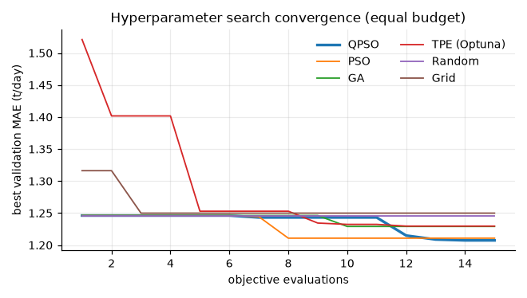
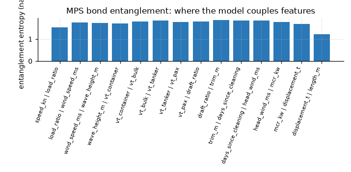

# Prediction benchmark

Generated by `make bench-quick` / `make bench-full`. All numbers are on held-out test data.

Data: scenarios A–C use physics-informed synthetic fleet telemetry (10 vessel classes, 20 ships; speed, cargo load, weather and vessel type as inputs). Scenario D uses **real ship data** when FuelCast is in `data/raw/fuelcast`.

**Scenario D (real data).** FuelCast (Hugging Face `krohnedigital/FuelCast`, CC BY-NC-ND 4.0): 5-minute sensor logs of two cruise ships and an offshore supply vessel with hindcast wind, waves and currents, 86,757 samples under way (> 3 kn). Inputs: speed over ground, wind and waves relative to the heading, current along the heading, draft-based load and trim where recorded, elapsed time, and the ship's identity (one-hot, given to every model; the physics baselines calibrate per ship anyway). Engine power and rpm are excluded as leakage. Split: per ship, train on the first 60 % of the time series and test on the last 15 %. The FuelCast paper (arXiv 2510.08217) uses interval-wise cross-validation with MAE/R², so its numbers are not directly comparable. The data is used for evaluation only: it is not redistributed, and the production model is trained on synthetic data.

*Scenario D re-run separately (49 s) after giving every model the ship identity.*

## Known ships, future period

Train rows: 15,000; test rows: 7,042; ships in test: 20

| Model | MAPE % | MAE t/d | RMSE t/d | R² | fit s |
|---|---|---|---|---|---|
| Q-PHYS (quantum-inspired hybrid) | 3.293 | 1.760 | 4.394 | 0.987 | 181.1 |
| Q-PHYS-M (certified monotone) | 3.331 | 1.766 | 4.288 | 0.988 | 181.1 |
| Physics (grey-box / calibrated) | 3.414 | 1.842 | 4.507 | 0.987 | 0.557 |
| LightGBM (default) | 5.280 | 1.883 | 3.305 | 0.993 | 0.905 |
| MLP neural net | 6.316 | 2.286 | 3.787 | 0.991 | 2.635 |
| Random forest | 7.019 | 2.299 | 3.895 | 0.990 | 4.477 |
| Physics (nominal, IMO GHG4 + Kwon) | 9.015 | 3.449 | 5.251 | 0.982 | 0.092 |
| MPS tensor network (stand-alone) | 12.130 | 4.240 | 7.801 | 0.960 | 9.189 |
| Polynomial speed (baseline) | 12.591 | 4.311 | 6.805 | 0.969 | 0.303 |
| Ridge regression | 32.188 | 7.188 | 8.976 | 0.947 | 0.569 |

Q-PHYS 90 % conformal interval: empirical coverage **0.891**, relative half-width ±6.3 %.

Wilcoxon signed-rank test on per-ship MAE (H1: Q-PHYS error is lower):

| Baseline | p-value | ships where Q-PHYS better |
|---|---|---|
| Polynomial speed (baseline) | 0.000 | 20/20 |
| Physics (grey-box / calibrated) | 0.001 | 17/20 |
| Physics (nominal, IMO GHG4 + Kwon) | 0.000 | 19/20 |
| Ridge regression | 0.000 | 19/20 |
| Random forest | 0.000 | 19/20 |
| LightGBM (default) | 0.001 | 18/20 |
| MLP neural net | 0.000 | 19/20 |
| MPS tensor network (stand-alone) | 0.000 | 19/20 |

## Unseen ships of known classes

Train rows: 15,000; test rows: 23,380; ships in test: 10

| Model | MAPE % | MAE t/d | RMSE t/d | R² | fit s |
|---|---|---|---|---|---|
| Q-PHYS (quantum-inspired hybrid) | 5.636 | 2.383 | 4.413 | 0.987 | 215.0 |
| Q-PHYS-M (certified monotone) | 5.943 | 2.436 | 4.502 | 0.986 | 215.0 |
| LightGBM (default) | 5.981 | 2.536 | 4.607 | 0.986 | 0.483 |
| MLP neural net | 6.903 | 2.787 | 4.887 | 0.984 | 2.465 |
| MPS tensor network (stand-alone) | 7.407 | 3.545 | 8.065 | 0.957 | 47.149 |
| Random forest | 7.655 | 3.096 | 5.427 | 0.980 | 4.589 |
| Physics (nominal, IMO GHG4 + Kwon) | 8.222 | 3.074 | 5.000 | 0.983 | 0.268 |
| Physics (grey-box / calibrated) | 10.449 | 4.332 | 8.184 | 0.955 | 0.463 |
| Ridge regression | 21.586 | 6.138 | 9.031 | 0.946 | 0.022 |
| Polynomial speed (baseline) | 38.313 | 12.472 | 18.543 | 0.771 | 0.006 |

Q-PHYS 90 % conformal interval: empirical coverage **0.998**, relative half-width ±25.2 %.

Wilcoxon signed-rank test on per-ship MAE (H1: Q-PHYS error is lower):

| Baseline | p-value | ships where Q-PHYS better |
|---|---|---|
| Polynomial speed (baseline) | 0.001 | 10/10 |
| Physics (grey-box / calibrated) | 0.002 | 9/10 |
| Physics (nominal, IMO GHG4 + Kwon) | 0.024 | 7/10 |
| Ridge regression | 0.001 | 10/10 |
| Random forest | 0.010 | 8/10 |
| LightGBM (default) | 0.348 | 5/10 |
| MLP neural net | 0.042 | 8/10 |
| MPS tensor network (stand-alone) | 0.003 | 9/10 |

## Unseen classes PANAMAX_C, SUPRAMAX, MR_TANKER

Train rows: 15,000; test rows: 15,207; ships in test: 6

| Model | MAPE % | MAE t/d | RMSE t/d | R² | fit s |
|---|---|---|---|---|---|
| Q-PHYS (quantum-inspired hybrid) | 6.007 | 2.918 | 6.295 | 0.965 | 80.837 |
| Q-PHYS-M (certified monotone) | 6.007 | 2.918 | 6.295 | 0.965 | 80.837 |
| Physics (grey-box / calibrated) | 7.854 | 2.898 | 4.705 | 0.980 | 0.734 |
| Physics (nominal, IMO GHG4 + Kwon) | 7.854 | 2.898 | 4.705 | 0.980 | 0.407 |
| Random forest | 11.348 | 3.766 | 5.234 | 0.976 | 6.198 |
| MLP neural net | 17.662 | 10.336 | 17.650 | 0.723 | 2.167 |
| Ridge regression | 20.754 | 6.190 | 9.109 | 0.926 | 0.027 |
| Polynomial speed (baseline) | 22.699 | 9.584 | 17.829 | 0.717 | 0.007 |
| LightGBM (default) | 34.784 | 18.883 | 31.756 | 0.102 | 32.467 |
| MPS tensor network (stand-alone) | 39.395 | 18.756 | 33.269 | 0.014 | 8.315 |

Q-PHYS 90 % conformal interval: empirical coverage **0.984**, relative half-width ±18.9 %.

Wilcoxon signed-rank test on per-ship MAE (H1: Q-PHYS error is lower):

| Baseline | p-value | ships where Q-PHYS better |
|---|---|---|
| Polynomial speed (baseline) | 0.016 | 6/6 |
| Physics (grey-box / calibrated) | 0.219 | 5/6 |
| Physics (nominal, IMO GHG4 + Kwon) | 0.219 | 5/6 |
| Ridge regression | 0.016 | 6/6 |
| Random forest | 0.156 | 4/6 |
| LightGBM (default) | 0.016 | 6/6 |
| MLP neural net | 0.016 | 6/6 |
| MPS tensor network (stand-alone) | 0.016 | 6/6 |

## FuelCast (real, 3 ships)

Train rows: 15,000; test rows: 13,015; ships in test: 3

| Model | MAPE % | MAE t/d | RMSE t/d | R² | fit s |
|---|---|---|---|---|---|
| Q-PHYS-M (certified monotone) | 7.283 | 4.778 | 8.446 | 0.966 | 35.618 |
| Physics (grey-box / calibrated) | 9.254 | 7.020 | 10.207 | 0.950 | 0.017 |
| Q-PHYS (quantum-inspired hybrid) | 9.827 | 7.205 | 10.117 | 0.951 | 35.618 |
| Polynomial speed (baseline) | 10.130 | 6.844 | 9.946 | 0.952 | 0.006 |
| Random forest | 10.689 | 6.511 | 11.151 | 0.940 | 3.671 |
| LightGBM (default) | 11.649 | 6.451 | 10.513 | 0.947 | 0.407 |
| Ridge regression | 13.538 | 7.312 | 10.110 | 0.951 | 0.019 |
| MPS tensor network (stand-alone) | 18.502 | 9.868 | 14.657 | 0.897 | 5.354 |
| MLP neural net | 29.275 | 26.917 | 37.346 | 0.328 | 3.068 |

Q-PHYS 90 % conformal interval: empirical coverage **0.893**, relative half-width ±17.4 %.

## Hyperparameter tuning: convergence speed and quality

Equal budget of 15 evaluations, 1 seed(s).

| Tuner | best val MAE | sd | evals to ≤1 % of best | seconds |
|---|---|---|---|---|
| QPSO | 1.207 | 0.000 | 12 | 12.588 |
| PSO | 1.211 | 0.000 | 8 | 10.054 |
| GA | 1.229 | 0.000 | - | 9.316 |
| TPE (Optuna) | 1.230 | 0.000 | - | 7.396 |
| Random | 1.246 | 0.000 | - | 8.572 |
| Grid | 1.250 | 0.000 | - | 6.115 |

## Feature selection

Speed, load, weather and vessel type are mandatory inputs (PS Delivery Table); the search covers the rest.

| Method | penalised val MAE | features | evaluations |
|---|---|---|---|
| QIEA | 1.238 | 15 | 24 |
| GA | 1.226 | 14 | 30 |
| All features | 1.256 | 21 | 1 |

## Inside the quantum-inspired model

Entanglement entropy across each bond of the trained Matrix Product State shows where the model carries correlations between neighbouring features.

*Benchmark runtime: 11.9 min.*
